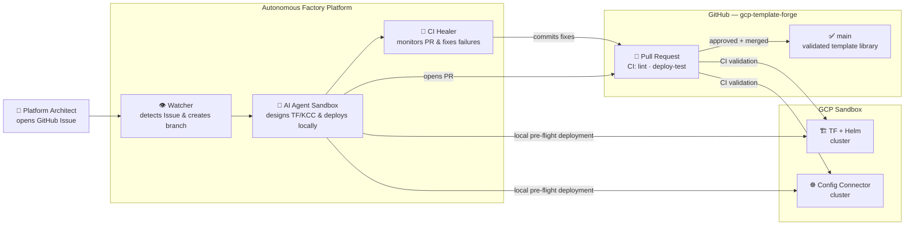

# GCP Template Forge

> An autonomous, AI-driven Factory pipeline that designs, deploys, and validates production-ready GKE reference architectures — dual-path (Terraform + Helm and Config Connector) — triggered entirely by GitHub issues.

## Objectives

1. **Autonomous Design** — Utilize a specialized AI Agent Factory (powered by Gemini models) to ingest GitHub Issues and autonomously author complete, enterprise-grade IaC templates from Google Cloud reference architectures, covering both Terraform/Helm and Config Connector deployment paths.
2. **Deploy & Validate** — Ensure every generated template physically provisions in a real GCP sandbox (`gca-gke-2025`). The Agent actively monitors the deployment until all workloads reach a 'Running' state before opening a Pull Request. 
3. **CI/CD Healing** — The Factory continuously monitors the repository's GitHub Actions pipeline. If CI validation fails, the Agent autonomously reads the logs, heals the codebase, and pushes fixes until the PR is green and mergeable.
4. **Consolidate** — Act as a living, continuously-validated library of GKE patterns drawn from Google Cloud's public reference repositories, so platform teams can adopt them with confidence.

---

## System Architecture: The Factory Approach

The Factory operates on an event-driven model where infrastructure requests are transformed into validated code through a closed-loop automated lifecycle, hosted on a dedicated GKE control-plane cluster.



### Key Components

| Component | Role |
|---|---|
| **The Watcher** | A continuous polling service that monitors the repository for issues tagged with `status:ai-agent-active`. It provisions the workspace, creates a git branch, and delegates the task to the Agent Factory. |
| **Agent Factory** | An isolated environment that executes the LLM reasoning loop. The Factory reads repository standards, authors dual-path IaC files, and executes physical deployments against the sandbox project to ensure the architecture is functional. |
| **CI Healer** | An active polling loop that monitors the GitHub Actions CI pipeline for a given PR. If checks fail (e.g. linting or validation), the Healer automatically fetches logs, applies fixes to the code, and pushes a new commit to restore pipeline health. |
| **The Housekeeper** | A cron job that purges orphaned GCP infrastructure, breaks stale Terraform state locks, and cleans up the sandbox to maintain budget and quota efficiency. |

### Repository Layout

```
.github/
  workflows/
    sandbox-validation-*.yml  ← Parallel CI gates (Lint, TF Deploy, KCC Deploy)
    cleanup-orphans.yml       ← Automated quota management
agent-infra/
  manifests/                ← Deployment manifests for the Factory infrastructure
templates/                  ← Validated template library
README.md                   ← This document
```

---

## The Deployment Lifecycle

### 1. Issue Ingestion
A user opens an Epic detailing architectural requirements. The Watcher detects the issue and triggers the Agent Factory.

### 2. Research & Strategy
The Factory clones the repository and reads local architectural standards (like this `README.md`) to apply strict formatting, unique resource naming conventions, and constraints.

### 3. Dual-Path Execution & Pre-flight
The Factory authors the code for both paths:
*   **Terraform/Helm (`terraform-helm/`)**: Provisions infrastructure via Terraform and deploys operator workloads (e.g., KubeRay, Kueue) via Helm.
*   **Config Connector (`config-connector/`)**: Provisions infra via raw KRM YAML and independently deploys the necessary operators and CRDs to prove the architecture's intent.

The Factory executes these files natively against GCP, running an active polling loop to verify the resources reach a `RUNNING` status.

### 4. Continuous CI Validation
Once the PR is opened, the native GitHub Actions pipeline acts as the independent gatekeeper:
1. **Linting:** Validates formatting (`terraform fmt`) and YAML syntax.
2. **Parallel Deployments:** Distinct jobs spin up the TF path and the KCC path simultaneously to prevent naming collisions.
3. **Healing:** If the CI pipeline fails, the Factory's Healer intervenes, reads the log, pushes a fix, and waits for a green build.

---

## Templates

| Template | TF+Helm | KCC | Validated |
|---|---|---|---|
| [basic-gke-hello-world](templates/basic-gke-hello-world/) | GKE Standard + hello-world | GKE Standard + hello-world | — |
| [enterprise-gke](templates/enterprise-gke/) | GKE Standard + security stack + Helm workload | GKE Standard + security stack + KCC workload | — |
| [latest-gke-features](templates/latest-gke-features/) | GKE Standard + Gateway API + NAP + Native Sidecars | GKE Standard + Native Sidecars + Gateway API | — |
| [gke-fqdn-egress-security](templates/gke-fqdn-egress-security/) | GKE Standard + FQDN Network Policies + AI Egress | GKE Standard + KCC Networking | — |
| [gke-topology-aware-routing](templates/gke-topology-aware-routing/) | GKE Standard + Topology-Aware Routing + Gateway API | GKE Standard + Topology-Aware Routing + Gateway API | — |

---

## Handling GCP Quota Errors
If your CI run or local Factory deployment fails with a quota limit error (e.g., `Quota 'NETWORKS' exceeded. Limit: 30.0 globally`), it means previous runs have left orphaned resources clogging up the project. You must not attempt to modify your template code if the only failure is a quota limit. 

Instead, execute the following command in your terminal to manually trigger the Housekeeper workflow:
```bash
gh workflow run cleanup-orphans.yml --repo fkc1e100/gcp-template-forge
```
After the cleanup finishes, push an empty commit to your branch to re-trigger the pipeline:
```bash
git commit --allow-empty -m "ci: retry after quota cleanup"
git push origin HEAD
```
