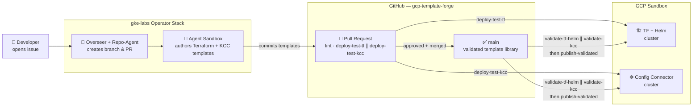
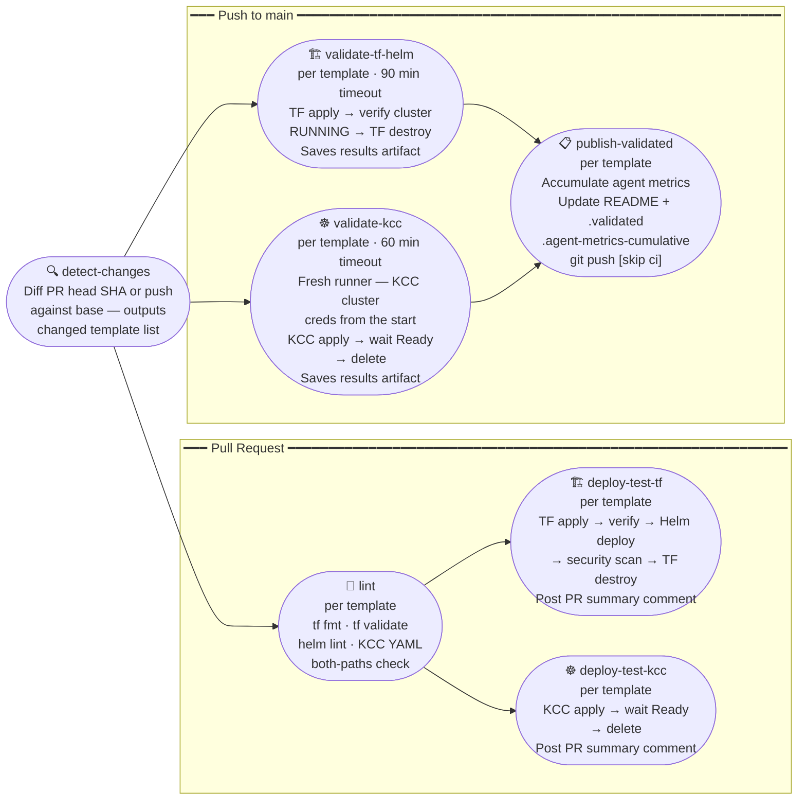
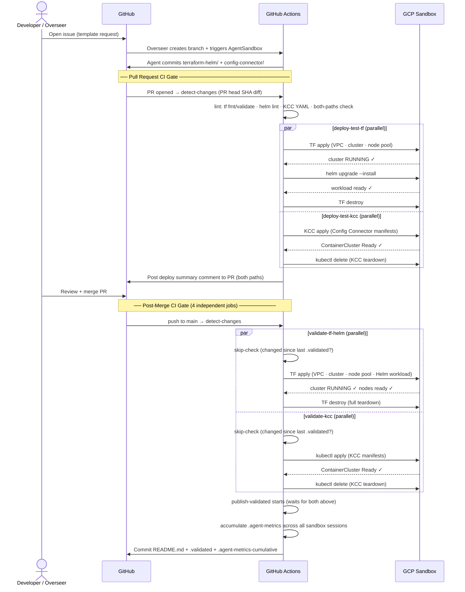

# GCP Template Forge

> An AI-driven pipeline that designs, deploys, and validates production-ready GKE reference architectures — dual-path (Terraform + Helm and Config Connector) — with every merge.

## Objectives

1. **Design** — Use an AI agent (Gemini CLI + Claude) to author complete, enterprise-grade IaC templates from Google Cloud reference architectures, covering both Terraform/Helm and Config Connector deployment paths.
2. **Deploy & Test** — Run every template through a full apply → verify → destroy cycle in a real GCP sandbox project before any PR is merged, and again after merge to confirm the published artifact works end-to-end.
3. **Consolidate** — Act as a living, continuously-validated library of GKE patterns drawn from Google Cloud's public reference repositories, so teams can adopt them with confidence.

---

## System Architecture

The forge is powered by the operator stack from [`gke-labs/gemini-for-kubernetes-development`](https://github.com/gke-labs/gemini-for-kubernetes-development), running on a GKE Standard control-plane cluster.



### Key Components

| Component | Role | Repo |
|---|---|---|
| **Overseer** | Kubernetes operator that watches GitHub for new issues, coordinates the agent lifecycle, and manages PR state | [`gke-labs/gemini-for-kubernetes-development`](https://github.com/gke-labs/gemini-for-kubernetes-development) |
| **Repo-Agent** | Creates GitHub issues, branches, and PRs; posts status comments; triggers the agent sandbox | same |
| **AgentSandboxes** | Kubernetes Jobs that spin up an isolated Gemini CLI session per template; the agent authors all IaC files and commits them | same |
| **CI Service Account** | GCP service account used by GitHub Actions CI to authenticate and run Terraform/Helm/KCC against the sandbox project | `agent-infra/` |

### Repository Layout

```
.github/
  workflows/
    sandbox-validation.yml  ← lint · deploy-test-tf ∥ deploy-test-kcc (PR) · validate-tf-helm ∥ validate-kcc · publish-validated (push)
  ISSUE_TEMPLATE/           ← template request form
agent-infra/
  terraform/                ← control-plane GKE cluster + CI service account
  manifests/                ← Overseer + Repo-Agent + AgentSandboxes deployments
templates/                  ← validated template library (see Templates section below)
GEMINI.md                   ← guardrails and instructions for the Gemini CLI agent
GUIDANCE.md                 ← manual setup steps (identity, Secret Manager)
```

---

## CI Pipeline

### Job dependency graph



> `deploy-test-tf` and `deploy-test-kcc` run **in parallel** on separate runners after lint passes. Likewise, `validate-tf-helm` and `validate-kcc` both run in parallel on push to main — GCP resource name collisions are avoided by the `-tf` / `-kcc` suffix convention on all resource names. `publish-validated` waits for both validate jobs to complete before updating the README and `.validated` marker.

### End-to-end sequence



### Template structure

```
templates/<name>/
├── terraform-helm/              ← Terraform + Helm deployment path
│   ├── main.tf                  ← VPC · cluster · workload resources
│   ├── variables.tf
│   ├── versions.tf              ← pinned provider versions + GCS backend
│   ├── outputs.tf               ← cluster_name + cluster_location (required by CI)
│   └── workload/                ← Helm chart for the workload
│       ├── Chart.yaml
│       ├── values.yaml
│       └── templates/
├── config-connector/            ← Config Connector (KCC) deployment path
│   ├── network.yaml             ← ComputeNetwork + ComputeSubnetwork
│   ├── cluster.yaml             ← ContainerCluster (+ NodePool if standard)
│   └── workload/                ← Kubernetes manifests for the workload (optional)
│       └── *.yaml               ← Deployment · Service · HPA · NetworkPolicy etc.
├── README.md                    ← auto-updated by CI with validation record
├── .validated                   ← CI marker: commit + status after successful deploy
├── .agent-metrics               ← written by agent sandbox (latest session)
└── .agent-metrics-cumulative    ← CI-maintained running total across all sessions
```

**CI enforcement rules:**
- Both `terraform-helm/` and `config-connector/` must exist (lint fails otherwise)
- `google_container_cluster` must have `deletion_protection = false`
- KCC manifests must not use `cnrm.cloud.google.com/deletion-policy: abandon`
- Resources must use template-based names (e.g., `enterprise-gke-vpc`) not issue numbers
- `validate-tf-helm` / `validate-kcc` re-run whenever the template changes since last `.validated` commit

---

## Templates

| Template | TF+Helm | KCC | Validated |
|---|---|---|---|
| [basic-gke-hello-world](templates/basic-gke-hello-world/) | GKE Autopilot + hello-world | GKE Autopilot | — |
| [enterprise-gke](templates/enterprise-gke/) | GKE Standard + security stack + Helm workload | GKE Standard + networking | — |

---

## Public Reference Sources

The forge validates patterns drawn from:

| Source | Focus |
|---|---|
| [Cloud Foundation Toolkit](https://github.com/GoogleCloudPlatform/cloud-foundation-toolkit) | GCP security baselines |
| [Cluster Toolkit](https://github.com/GoogleCloudPlatform/cluster-toolkit) | HPC + AI/ML clusters |
| [Kubernetes Engine Samples](https://github.com/GoogleCloudPlatform/kubernetes-engine-samples) | GKE workload patterns |
| [Terraform GKE Modules](https://github.com/terraform-google-modules/terraform-google-kubernetes-engine) | Reusable TF modules |
| [GKE AI Labs](https://gke-ai-labs.dev/) | AI/ML on GKE |
| [Gemini for Kubernetes Development](https://github.com/gke-labs/gemini-for-kubernetes-development) | Operator stack powering this forge |
| [Accelerated Platforms](https://github.com/GoogleCloudPlatform/accelerated-platforms) | GPU/TPU workloads |
| [GKE Policy Automation](https://github.com/google/gke-policy-automation) | Policy as code |
| [LLM-D](https://github.com/llm-d/llm-d) | LLM inference on GKE |
