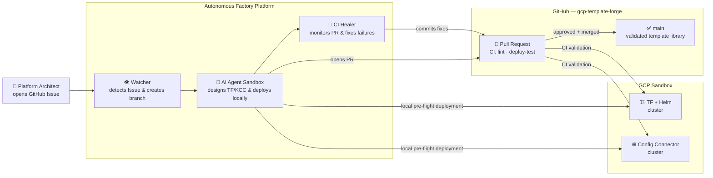

# GCP Template Forge (Template Catalog)

This repository serves as the **living, continuously-validated reference architecture template storage** for the **Forge Factory**—an autonomous, AI-driven IaC generation factory. 

> [!NOTE]
> The actual pipeline orchestrator, Go watcher daemons, AI agent sandbox templates, and GKE Borg manifests reside in the separate control plane repository: **[fkc1e100/forge-factory](https://github.com/fkc1e100/forge-factory)**. This repository (`gcp-template-forge`) is strictly dedicated to hosting the production-ready template catalogue and the GitHub Actions validation engines.

---

## System Architecture: The Factory Approach

The Factory operates on an event-driven model where infrastructure requests are transformed into validated code through a closed-loop automated lifecycle, hosted on a dedicated GKE control-plane cluster.


```mermaid
flowchart LR
    DEV["👤 Platform Architect\nopens GitHub Issue"]

    subgraph FACTORY ["Autonomous Factory Platform"]
        WATCH["👁️ Watcher\ndetects Issue & creates branch"]
        AG["🤖 AI Agent Sandbox\ndesigns TF/KCC & deploys locally"]
        HEAL["🏥 CI Healer\nmonitors PR & fixes failures"]
        WATCH --> AG
        AG --> HEAL
    end

    subgraph GH ["GitHub — gcp-template-forge"]
        PR["🔀 Pull Request\nCI: lint · deploy-test"]
        MAIN["✅ main\nvalidated template library"]
        HEAL -->|commits fixes| PR
        PR -->|approved + merged| MAIN
    end

    subgraph GCP ["GCP Sandbox"]
        TF["🏗️ TF + Helm\ncluster"]
        KCC["☸️ Config Connector\ncluster"]
    end

    DEV --> WATCH
    AG -->|local pre-flight deployment| TF
    AG -->|local pre-flight deployment| KCC
    AG -->|opens PR| PR
    PR -->|CI validation| TF
    PR -->|CI validation| KCC
```

### Key Components

| Component | Role |
|---|---|
| **The Watcher** | A continuous polling service that monitors the repository for issues tagged with `status:ai-agent-active`. It provisions the workspace, creates a git branch, and delegates the task to the Agent Factory. |
| **Agent Factory** | An isolated environment that executes the LLM reasoning loop. The Factory reads repository standards, authors dual-path IaC files, and executes physical deployments against the sandbox project to ensure the architecture is functional. |
| **CI Healer** | An active polling loop that monitors the GitHub Actions CI pipeline for a given PR. If checks fail (e.g. linting or validation), the Healer automatically fetches logs, applies fixes to the code, and pushes a new commit to restore pipeline health. |
| **The Housekeeper** | A cron job that purges orphaned GCP infrastructure, breaks stale Terraform state locks, and cleans up the sandbox to maintain budget and quota efficiency. |

### Repository Layout

```
.github/
  workflows/
    sandbox-validation-*.yml  ← Parallel CI gates (Lint, TF Deploy, KCC Deploy)
    cleanup-orphans.yml       ← Automated quota management
agent-infra/
  manifests/                ← Deployment manifests for the Factory infrastructure
templates/                  ← Validated template library
README.md                   ← This document
```

---

## The Deployment Lifecycle

### 1. Issue Ingestion
A user opens an Epic detailing architectural requirements. The Watcher detects the issue and triggers the Agent Factory.

### 2. Research & Strategy
The Factory clones the repository and reads local architectural standards (like this `README.md`) to apply strict formatting, unique resource naming conventions, and constraints.

### 3. Dual-Path Execution & Pre-flight
The Factory authors the code for both paths:
*   **Terraform/Helm (`terraform-helm/`)**: Provisions infrastructure via Terraform and deploys operator workloads (e.g., KubeRay, Kueue) via Helm.
*   **Config Connector (`config-connector/`)**: Provisions infra via raw KRM YAML and independently deploys the necessary operators and CRDs to prove the architecture's intent.

The Factory executes these files natively against GCP, running an active polling loop to verify the resources reach a `RUNNING` status.

### 4. Continuous CI Validation
Once the PR is opened, the native GitHub Actions pipeline acts as the independent gatekeeper:
1. **Linting:** Validates formatting (`terraform fmt`) and YAML syntax.
2. **Parallel Deployments:** Distinct jobs spin up the TF path and the KCC path simultaneously to prevent naming collisions.
3. **Healing:** If the CI pipeline fails, the Factory's Healer intervenes, reads the log, pushes a fix, and waits for a green build.

---

## Reference Architecture Templates Catalogue

The following is the official roster of advanced, production-ready GKE templates autonomously developed and continuously validated by the Forge Factory:

| Template Directory | Description | Target GKE Capabilities Tested |
|---|---|---|
| **[gke-basic-hello-world](templates/gke-basic-hello-world/)** | VPC-Native GKE Standard baseline cluster. | Baseline nodes, custom networking, simple workloads. |
| **[gke-custom-compute-class](templates/gke-custom-compute-class/)** | Advanced compute scheduling segregation with custom Node Classes. | Node Auto-Provisioning (NAP), taints, tolerations, namespace quotas. |
| **[gke-enterprise-cluster](templates/gke-enterprise-cluster/)** | Hardened, regional multi-zone enterprise GKE Standard cluster. | Workload Identity Federation, custom regional node locations, IAM bindings. |
| **[gke-fqdn-egress-security](templates/gke-fqdn-egress-security/)** | Secure GKE egress control utilizing fully qualified domain names. | FQDN-based network policies, egress validation, AI serving secure boundaries. |
| **[gke-inference-fuse-cache](templates/gke-inference-fuse-cache/)** | High-performance GKE AI/ML dataset streaming cluster. | GCS FUSE CSI Driver addon, dataset local caching, read-only mounts. |
| **[gke-k8s-rbac-manager](templates/gke-k8s-rbac-manager/)** | Declarative in-cluster Kubernetes RBAC management blueprint. | IAM custom role bindings, GKE ServiceAccounts, custom ClusterRoles. |
| **[gke-k8s-service-deployment](templates/gke-k8s-service-deployment/)** | Highly-available regional workload distribution template. | Topological spread constraints, regional node scheduling, values override. |
| **[gke-kuberay-kueue](templates/gke-kuberay-kueue/)** | Distributed GKE AI/ML ray processing queue engine. | KubeRay operator management, Kueue queue scheduling, ray jobs routing. |
| **[gke-latest-features](templates/gke-latest-features/)** | GKE platform showcase leveraging the newest GKE API additions. | Native Sidecar Containers (init containers), GKE Gateway API, custom storage. |
| **[gke-online-boutique](templates/gke-online-boutique/)** | Google's multi-service Online Boutique microservices suite. | Dual-path Helm/TF routing, raw KRM KCC workloads, load balancer egress. |
| **[gke-spot-autoscale](templates/gke-spot-autoscale/)** | High-efficiency cost-optimized GKE autoscale blueprint. | Spot instances nodes pools, Horizontal Pod Autoscaler (HPA), capacity buffers. |
| **[gke-test-kcc-skip](templates/gke-test-kcc-skip/)** | Specialized GKE validation testing benchmark template. | Validation skip properties, trigger controls, telemetry bypass. |
| **[gke-topo-routing](templates/gke-topo-routing/)** | High-performance advanced networking and routing engine. | Topology-Aware Routing, GKE Gateway API class, service mesh baseline. |

---

## Handling GCP Quota Errors
If your CI run or local Factory deployment fails with a quota limit error (e.g., `Quota 'NETWORKS' exceeded. Limit: 30.0 globally`), it means previous runs have left orphaned resources clogging up the project. You must not attempt to modify your template code if the only failure is a quota limit. 

Instead, execute the following command in your terminal to manually trigger the Housekeeper workflow:
```bash
gh workflow run cleanup-orphans.yml --repo fkc1e100/gcp-template-forge
```
After the cleanup finishes, push an empty commit to your branch to re-trigger the pipeline:
```bash
git commit --allow-empty -m "ci: retry after quota cleanup"
git push origin HEAD
```
